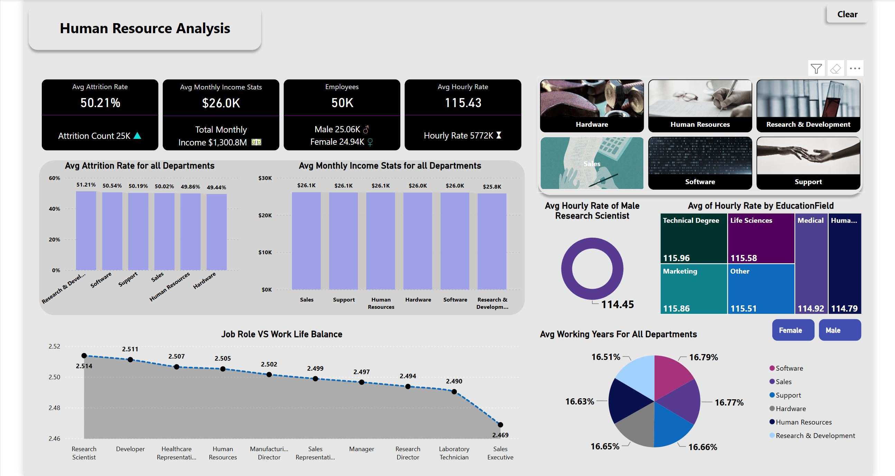

# 👥 HR Analytics: Employee Retention

This project analyzes employee retention trends using **MySQL** for data processing and **Power BI** for creating interactive dashboards. The goal is to provide actionable insights that help HR teams make data-driven decisions to improve retention and employee engagement.

---

## 📌 Objective

To uncover key trends related to employee attrition, satisfaction, compensation, and department-wise retention using real-world HR data.

---

## 🛠 Tools & Technologies Used

- **MySQL** – For querying and analyzing structured HR data  
- **Power BI** – For building interactive, insight-rich dashboards

---

## 🧪 Key Features

- Department-wise attrition rate analysis  
- Average salary and income distribution  
- Work-life balance trends by job role  
- KPI-focused Power BI dashboard for quick insights

---

## 📈 Dashboard Preview

---

## 📚 How to Use

1. Load your HR dataset into MySQL.
2. Run the queries from `employee_retention_queries.sql` to explore key metrics.
3. Open `employee_retention_dashboard.pbix` in Power BI to interact with visual insights.

---

## ✅ Impact

This project demonstrates how HR departments can use data to understand workforce trends, predict attrition risks, and build better employee engagement strategies through visualization and insight.

---

## 📬 Contact

For questions or collaboration, feel free to reach out at [hoshangsheth@gmail.com](mailto:hoshangsheth@gmail.com)
